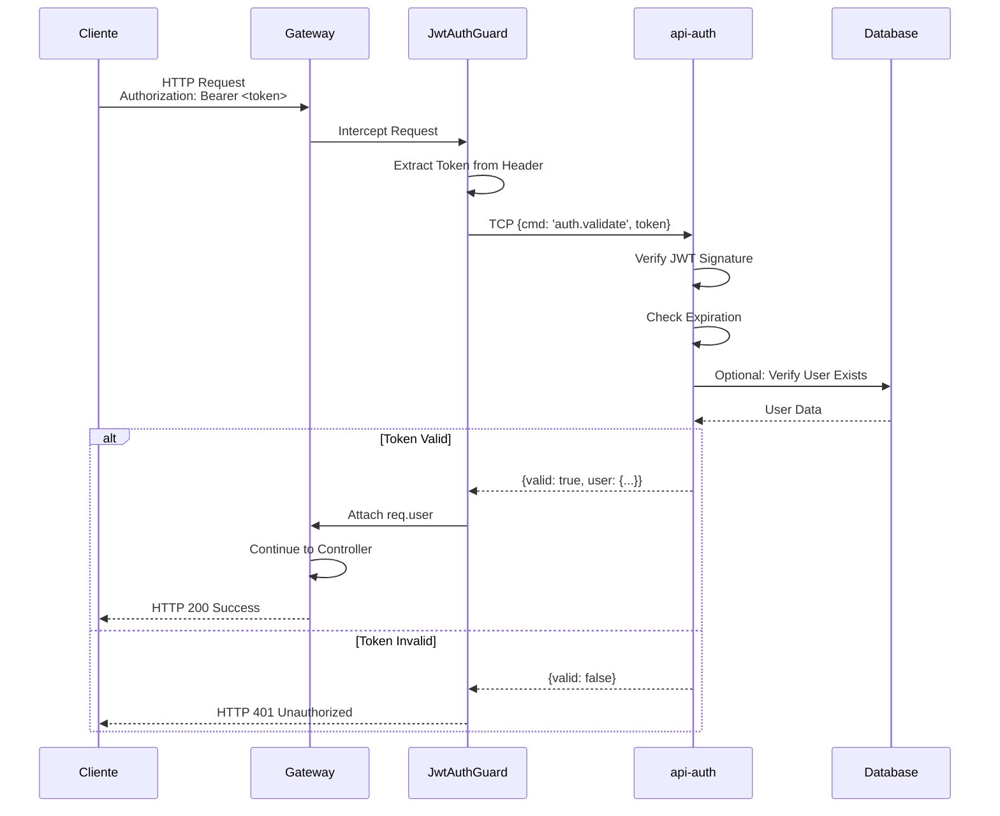
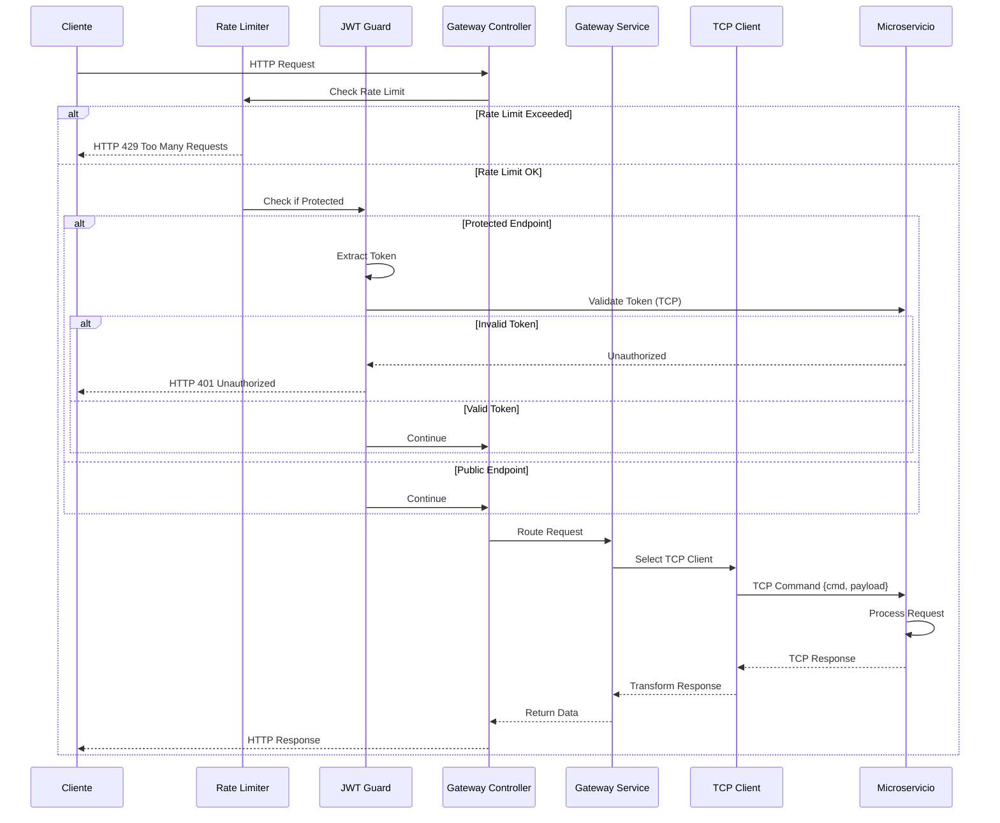

# API Gateway

El **API Gateway** es el punto único de entrada para todas las peticiones externas en la arquitectura de microservicios. Actúa como un proxy inverso que enruta las peticiones HTTP a los microservicios backend correspondientes usando comunicación TCP.

## 📋 Tabla de Contenidos

- [Descripción](#descripción)
- [Funcionalidades](#funcionalidades)
- [Arquitectura](#arquitectura)
- [Comunicación con Microservicios](#comunicación-con-microservicios)
- [Endpoints](#endpoints)
- [Configuración](#configuración)
- [Seguridad](#seguridad)
- [Observabilidad](#observabilidad)

## 🎯 Descripción

El API Gateway (`api-gateway`) es una aplicación NestJS que:

- Escucha en el puerto **3000** (configurable vía `PORT_GATEWAY`)
- Expone endpoints HTTP/REST con el prefijo `/api`
- Enruta peticiones a microservicios backend usando **TCP**
- Implementa rate limiting, autenticación JWT, y manejo centralizado de errores
- Proporciona documentación interactiva con Swagger

## ✨ Funcionalidades

### 1. Enrutamiento de Peticiones

El Gateway actúa como un proxy que enruta peticiones HTTP a los microservicios correspondientes:

- **Autenticación** → `api-auth` (puerto 3001)
- **Netflix Shows** → `netflix` (puerto 3002)
- **CSV Processing** → `csv-processor` (puerto 3003)

### 2. Rate Limiting

Implementa throttling global usando `@nestjs/throttler`:
- **Límite**: 10 peticiones por 60 segundos
- **Alcance**: Global para todos los endpoints
- **Configuración**: `apps/api-gateway/src/app/app.module.ts`

```typescript
ThrottlerModule.forRoot([{
  ttl: 60000,  // 60 segundos
  limit: 10,   // 10 peticiones
}]),
```

### 3. Autenticación JWT

El `JwtAuthGuard` valida tokens JWT antes de permitir acceso a endpoints protegidos:

```typescript
@Get('profile')
@UseGuards(JwtAuthGuard)
async getProfile(@Request() req: any) {
  // El token se valida con el servicio api-auth vía TCP
  // Si es válido, req.user contiene los datos del usuario
}
```

**Flujo de autenticación**:



### 4. Documentación Swagger

Swagger UI está disponible en:
- **URL**: http://localhost:3000/api/docs
- **Configuración**: `apps/api-gateway/src/config/swagger.config.ts`

### 5. Manejo Centralizado de Errores

Todos los errores se manejan de forma consistente usando `HttpExceptionFilter`.

## 🏗️ Arquitectura

### Estructura de Archivos

```
apps/api-gateway/
├── src/
│   ├── app/
│   │   ├── controllers/          # Controladores HTTP
│   │   │   ├── auth.controller.ts
│   │   │   ├── netflix.controller.ts
│   │   │   ├── csv.controller.ts
│   │   │   └── gateway.controller.ts
│   │   ├── services/             # Servicios de negocio
│   │   │   └── gateway.service.ts
│   │   ├── guards/               # Guards de autenticación
│   │   │   └── jwt-auth.guard.ts
│   │   ├── filters/              # Filtros de excepciones
│   │   ├── dtos/                 # Data Transfer Objects
│   │   └── app.module.ts         # Módulo principal
│   ├── config/
│   │   ├── microservices.config.ts  # Configuración de clientes TCP
│   │   ├── constants.ts             # Constantes y configuración TCP
│   │   ├── providers.config.ts      # Configuración de providers
│   │   ├── swagger.config.ts        # Configuración de Swagger
│   │   └── envs.ts                  # Variables de entorno
│   └── main.ts                  # Punto de entrada
```

### Flujo de una Petición



## 🔄 Comunicación con Microservicios

### Configuración de Clientes TCP

Los clientes TCP se configuran en `apps/api-gateway/src/config/microservices.config.ts`:

```typescript
export const microservicesConfig = ClientsModule.register([
  {
    name: SERVICES.API_AUTH,
    transport: Transport.TCP,
    options: {
      host: TCP_CONFIG.HOST,        // '127.0.0.1' por defecto
      port: TCP_CONFIG.PORTS.API_AUTH,  // 3001 por defecto
    },
  },
  {
    name: SERVICES.NETFLIX,
    transport: Transport.TCP,
    options: {
      host: TCP_CONFIG.HOST,
      port: TCP_CONFIG.PORTS.NETFLIX,   // 3002 por defecto
    },
  },
  {
    name: SERVICES.CSV_SERVICE,
    transport: Transport.TCP,
    options: {
      host: TCP_CONFIG.HOST,
      port: TCP_CONFIG.PORTS.CSV_PROCESSOR,  // 3003 por defecto
    },
  },
]);
```

### Envío de Comandos

El `GatewayService` (`apps/api-gateway/src/app/services/gateway.service.ts`) maneja la comunicación TCP:

```typescript
async sendCommand(serviceName: string, pattern: string, data?: any): Promise<ServiceResponse> {
  const client = this.getClient(serviceName);
  const command = { cmd: pattern };
  const payload = data ?? {};

  // Conectar cliente si no está conectado
  await client.connect();

  // Enviar comando con timeout
  const response = await firstValueFrom(
    client.send(command, payload).pipe(timeout(TCP_CONFIG.TIMEOUT))
  );

  return {
    success: true,
    data: response,
    timestamp: new Date().toISOString(),
  };
}
```

**Características**:
- **Timeout**: 5 segundos por defecto (configurable vía `TCP_TIMEOUT`)
- **Reconexión automática**: Los clientes se conectan automáticamente si no están conectados
- **Manejo de errores**: Los errores se capturan y se devuelven como respuestas estructuradas

### Ejemplo de Uso en Controlador

```typescript
@Controller('auth')
export class AuthController {
  constructor(
    @Inject(SERVICES.API_AUTH) private readonly authService: ClientProxy
  ) {}

  @Post('login')
  async login(@Body() dto: LoginUserDto) {
    // Envía comando 'auth.login' al servicio api-auth vía TCP
    return firstValueFrom(
      this.authService.send({ cmd: 'auth.login' }, dto)
    );
  }
}
```

## 📡 Endpoints

Todos los endpoints están disponibles bajo el prefijo `/api`.

### Autenticación (`/api/auth`)

| Método | Endpoint | Descripción | Autenticación |
|--------|----------|-------------|---------------|
| POST | `/api/auth/register` | Registrar nuevo usuario | No |
| POST | `/api/auth/login` | Iniciar sesión | No |
| POST | `/api/auth/refresh` | Refrescar token | No |
| POST | `/api/auth/validate` | Validar token | No |
| GET | `/api/auth/profile` | Obtener perfil de usuario | Sí (JWT) |

### Netflix Shows (`/api/services/netflix/netflix`)

| Método | Endpoint | Descripción | Autenticación |
|--------|----------|-------------|---------------|
| GET | `/api/services/netflix/netflix` | Listar shows (con paginación) | No |
| GET | `/api/services/netflix/netflix/:id` | Obtener show por ID | No |
| POST | `/api/services/netflix/netflix` | Crear nuevo show | No |
| PUT | `/api/services/netflix/netflix/:id` | Actualizar show | No |
| DELETE | `/api/services/netflix/netflix/:id` | Eliminar show | No |
| GET | `/api/services/netflix/netflix/search?title=...` | Buscar por título | No |
| GET | `/api/services/netflix/netflix/filter?type=...&year=...` | Filtrar shows | No |

### CSV Processing (`/api/csv`)

| Método | Endpoint | Descripción | Autenticación |
|--------|----------|-------------|---------------|
| POST | `/api/csv/process` | Subir y procesar archivo CSV | No |

**Ejemplo de uso**:
```bash
curl -X POST http://localhost:3000/api/csv/process \
  -F "file=@mi-archivo.csv"
```

### Documentación Swagger

- **URL**: http://localhost:3000/api/docs
- **Descripción**: Documentación interactiva de todos los endpoints con ejemplos de peticiones y respuestas

## ⚙️ Configuración

### Variables de Entorno

Agrega al archivo `.env` en la raíz del proyecto:

```env
# Puerto del Gateway
PORT_GATEWAY=3000

# Configuración TCP
SERVICE_HOST=127.0.0.1
TCP_TIMEOUT=5000

# Puertos de Microservicios
PORT_APIAUTH=3001
PORT_NETFLIX=3002
PORT_CSV_PROCESSOR=3003

# OpenTelemetry
OTEL_SERVICE_NAME=api-gateway
OTEL_EXPORTER_OTLP_ENDPOINT=http://localhost:4317
```

### Configuración de Rate Limiting

Edita `apps/api-gateway/src/app/app.module.ts`:

```typescript
ThrottlerModule.forRoot([{
  ttl: 60000,  // Tiempo en milisegundos
  limit: 10,   // Número de peticiones permitidas
}]),
```

### Configuración de Swagger

Edita `apps/api-gateway/src/config/swagger.config.ts` para personalizar la documentación.

## 🔒 Seguridad

### 1. Rate Limiting

Protege contra abuso de API limitando el número de peticiones por IP.

### 2. Helmet

Middleware de seguridad que establece varios headers HTTP:
- `X-Content-Type-Options: nosniff`
- `X-Frame-Options: DENY`
- `X-XSS-Protection: 1; mode=block`
- Y más...

### 3. CORS

Configurado para permitir peticiones desde cualquier origen en desarrollo. **Ajusta para producción**.

### 4. Validación de Inputs

Todos los DTOs se validan usando `class-validator` con modo whitelist.

### 5. Autenticación JWT

Los endpoints protegidos requieren un token JWT válido en el header:
```
Authorization: Bearer <token>
```

## 📊 Observabilidad

El Gateway está instrumentado con OpenTelemetry:

- **Traces**: Todas las peticiones HTTP se rastrean
- **Metrics**: Métricas de rendimiento y rate limiting
- **Logs**: Logs estructurados con Winston

**Ver en SigNoz**: http://localhost:8080

## 🚀 Ejecución

### Desarrollo

```bash
# Desde la raíz del proyecto
pnpm start:api-gateway

# O usando Nx directamente
nx serve api-gateway
```

### Producción

```bash
# Build
pnpm build:api-gateway

# Ejecutar build
node dist/apps/api-gateway/main.js
```

## 🧪 Testing

### Tests E2E

```bash
pnpm test:api-gateway:e2e
```

**Requisitos**:
- Todos los microservicios deben estar corriendo
- Bases de datos configuradas

## 📚 Referencias

- [README Principal](../../README.md)
- [Documentación de NestJS Microservices](https://docs.nestjs.com/microservices/basics)
- [DeepWiki - API Gateway](https://deepwiki.com/bleidertcs/nx-micro/5-api-gateway)

